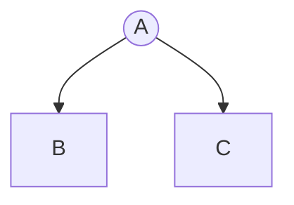

# أسهل ألغو

طريقة بسيطة محتاجين فيها غير BFS

نفترضو عندنا هاد الgraph:

## الخطوة الأولى

غادي نحسبو كل Hub شحال بعيد على اخر واحد

### Why it’s great for BFS:
- Lives directly inside mdBook markdown
- Version-controlled (no image files)
- Easy to edit
- Looks clean in docs
- Works great in GitHub Pages builds

### For BFS step-by-step (cool trick):

